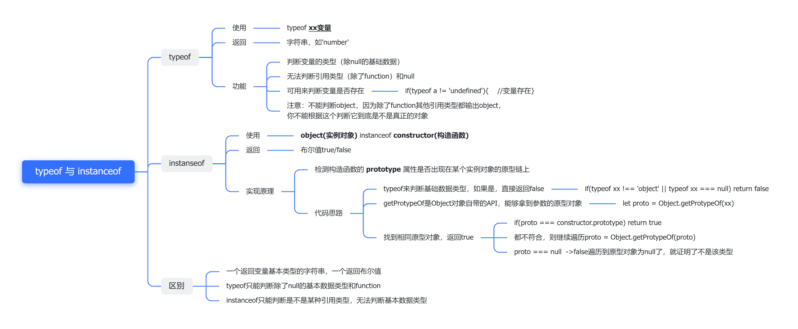

## typeof和instanceof


## instanceof手写
```js
function myInstanceof(left, right) {
    // 这里先用typeof来判断基础数据类型，如果是，直接返回false
    if(typeof left !== 'object' || left === null) return false;
    // getProtypeOf是Object对象自带的API，能够拿到参数的原型对象
    let proto = Object.getPrototypeOf(left);
    while(true) {                  
        if(proto === null) return false;
        if(proto === right.prototype) return true;//找到相同原型对象，返回true
        proto = Object.getPrototypeof(proto);
    }
}
```