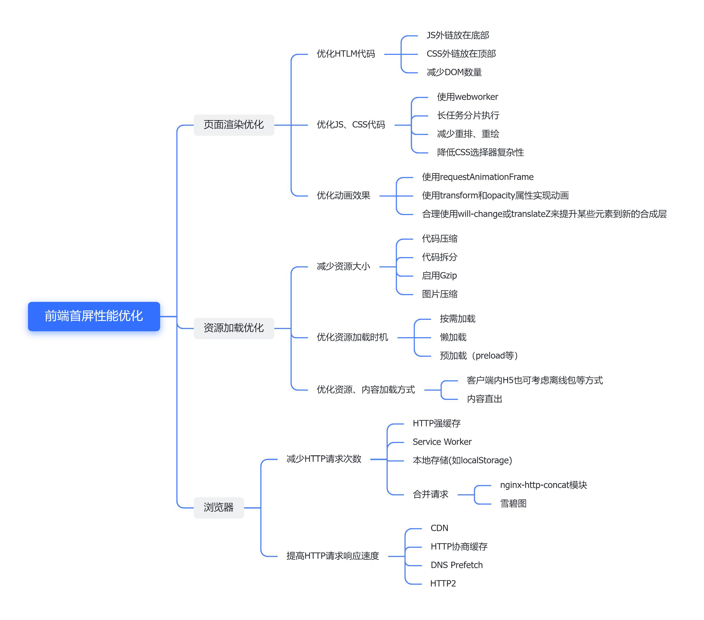

# 前端优化

面试的时候问到了，回答得一般般，在这里总结一些，持续更新……

## 首屏优化

### 概念

#### 首屏时间

首屏时间FCP（First Contentful Paint）：浏览器从响应用户输入网址地址，到首屏内容渲染完成的时间。

**影响因素：**

- 网络延迟
- 资源文件体积大
- 资源重复请求加载
- 加载脚本过程中渲染堵塞

**计算方式：**

首屏时间 = 首屏内容渲染结束时间点 - 开始请求的时间点

首屏时间的结束点一般认为是第一屏绘制完，因为无法直接得到时间点，所以需要获得第一屏内容底部位置，即首屏线，而计算方式也各不相同。

##### **标记首屏标签模块**

通过在HTML文档中，在首屏线的位置添加脚本去获取这个位置的时间。

**代码实现：**

```html
<!DOCTYPE html>
<html lang="en">
<head>
  <meta>
  <title></title>
  <script>
    window.pageStartTime = Date.now()
  </script>
  <link rel="" href="">
  <script>
    window.firstPaint = Date.now()
  </script>
</head>
<body>
  <div>第一屏</div>
  <script type="text/javascript">window.firstScreen = Date.now();
  </script>
  <div></div>
  <div></div>
</body>
</html>
```

首屏时间 = window.firstScreen - window.pageStartTime

**适用场景：**

- 首屏内不需要拉取数据，否则可能拿到首屏线获取时间的时候，首屏还是空白
- 不需要考虑图片加载，只考虑首屏主要模块

在业务中，较少使用这种算法，大多数页面需要使用接口，所以这种方法就太不常用

但是如果你的页面是静态页面，或者异步数据不影响整体的首屏体验，那么就可以使用这种办法

##### 统计首屏最慢图片加载时间

拿到首屏内所有的图片，遍历它们，逐个监听图片标签的onload事件，并收集到它们的加载时间，取最大值。

**代码实现：**

```html
<!DOCTYPE html>
<html lang="en">

<head>
  <meta charset="UTF-8">
  <meta name="viewport" content="width=device-width, initial-scale=1.0">
  <title>统计首屏最慢图片加载时间</title>
  <script>
    window.pageStartTime = Date.now()
  </script>
</head>

<body>
  
  
  <script>
    function load() {
      window.firstScreen = Date.now()
    }
    window.onload = function () {
      // 首屏时间
      console.log(window.firstScreen - window.pageStartTime)
    }
  </script>
</body>
</html>
```

首屏时间 = window.firstScreen - window.pageStartTime

**适用场景：**

首屏元素数量固定的页面，比如移动端首屏不论屏幕大小都展示相同数量的内容。

##### 自定义模块计算法

这种算法和标记首屏的方法相似，同样忽略了首屏内图片加载的情况，这个方法主要考虑的是异步数据。

在首屏标签标记法中，是无法计算到异步数据带来的首屏空白的，所以它的适配场景十分有限

自定义模块，就是根据首屏内接口计算比较得出最迟的时间

**代码实现：**

```html
<!DOCTYPE html>
<html lang="en">

<head>
  <meta charset="UTF-8">
  <meta name="viewport" content="width=device-width, initial-scale=1.0">
  <title>自定义模块计算法</title>
  <script>
    window.pageStartTime = Date.now()
  </script>
</head>

<body>
  <div>第一屏</div>
  <script type="text/javascript">
    setTimeout(() => {
      // 假设这里异步加载首屏要显示的文章列表数据
      window.firstScreen = Date.now();
    }, 500)
  </script>
  <div></div>
</body>

</html>

```

首屏时间 = window.firstScreen - window.pageStartTime

##### **window.performance获取首屏时间**

`window.performance`能够获取到相应的时间节点，支持IE9以上浏览器。

首屏时间 = performance.getEntriesByName(“first-contentful-paint”)[0].startTime - navigationStart

>  navigationStart：同一个浏览器上一个页面卸载(unload)结束时的时间戳。如果没有上一个页面，这个值会和fetchStart相同

#### 白屏时间

白屏时间FP（First Paint）：是指浏览器从响应用户输入网址地址，到浏览器开始显示内容的时间。

**影响因素：**

- 网络
- 服务端性能
- 前端页面结构设计

**计算方式：**

白屏时间 = 页面开始展示的时间点 - 开始请求的时间点

通常认为浏览器开始渲染`<body>`或者解析完`<head>`的时间是白屏结束的时间点。所以我们可以在html文档的head中所有的**静态资源**以及**内嵌脚本/样式**的**前面**记录一个时间点，在head**最底部**记录另一个时间点，两者的**差值**作为白屏时间。

**代码实现：**

```html
<!DOCTYPE html>
<html lang="en">
<head>
  <meta>
  <title></title>
  <script>
    window.pageStartTime = Date.now()
  </script>
  <link rel="" href="">
  <script>
    window.firstPaint = Date.now()
    console.log(`白屏时间：${}`)
  </script>
</head>
<body>
</body>
</html>
```

白屏时间= window.firstPaint - window.pageStartTime

缺点：无法获取解析HTML文档之前的时间信息。

### 优化手段



根据图片把几个点拿出来说说

#### 页面渲染部分

##### CSS放顶部，JS放尾部

CSS和JS都会阻塞页面的渲染，如果这些文件要加载和解析很久的话，页面就会呈现空白，也就是我们常说的白屏问题。

CSS放头部：因为如果先加载HTML再去加载CSS，会让用户第一时间看到页面是没有样式的，网站会很丑陋，用户体验会很不友好。

当然其实JS也可以放头部：只要给它加上defer或者async属性就可以了，异步下载，延迟执行。

关于 defer 与 async 区别：

- `script` ：加载和执行是同步、顺序的，没有兼容性问题，但会阻塞DOM的渲染，可能会导致长时间的白屏。
- `script defer`：异步下载，延迟执行，会等整个页面都解析完毕后执行，延迟的脚本是有顺序的，但有兼容性问题。
- `script async`：异步下载，延迟执行，但不保证等整个页面解析完毕后再执行，它是乱序的，这也比较适用百度或者谷歌分析这类不依赖其他脚本的库，有兼容性问题。

##### 使用webworker

web worker是运行在后台的js，独立于其他脚本，不会影响页面的性能。并且通过postMessage将结果回传到主线程。这样在进行复杂操作的时候，就不会阻塞主线程了。

##### 长任务分片执行

时间分片的原理是基于 JavaScript 的事件循环机制。在传统的事件循环中，当 JavaScript 引擎执行一个任务时，会一直占用主线程，直到任务执行完成。这可能导致长时间运行的任务阻塞主线程，影响页面的响应性。

时间分片通过将长时间运行的任务切分为多个小任务，并在每个小任务之间让出主线程，使得浏览器有机会处理其他任务和用户交互。通过将任务划分为小片段，时间分片可以在每个小任务之间进行上下文切换，从而提高页面的响应性。可以使用 `setTimeout` 或者 `requestAnimationFrame` 来实现类似的时间分片效果。

##### 降低CSS选择器的复杂性

浏览器读取选择器，遵循的原则是从选择器的右边到左边读取。看个示例：

```css
#block .text p {
    color: red;
}
```

1. 查找所有 P 元素。
2. 查找结果 1 中的元素是否有类名为 text 的父元素
3. 查找结果 2 中的元素是否有 id 为 block 的父元素

CSS 选择器优先级

```bash
内联 > ID选择器 > 类选择器 > 标签选择器
```

根据以上两个信息可以得出结论：

1. 减少嵌套。后代选择器的开销是最高的，因此我们应该尽量将选择器的深度降到最低（最高不要超过三层），尽可能使用类来关联每一个标签元素
2. 关注可以通过继承实现的属性，避免重复匹配重复定义
3. 尽量使用高优先级的选择器，例如 ID 和类选择器。
4. 避免使用通配符，只对需要用到的元素进行选择

#### 资源优化部分

##### 代码拆分

代码分割是一种将代码分割成多个小块的方式，然后按需加载或并行加载所需的块的技术。代码分割可以用于减少应用程序的初始加载时间或将代码切割成可按需加载的块，从而减少应用程序所需的总体代码量。如使用import；在react中使用React.lazy、React Router分割。

##### 预加载

preload 提供了一种声明式的命令，让**浏览器提前加载指定资源**(加载后并不执行)，在需要执行的时候再执行。提供的好处主要是：

- 将加载和执行分离开，可不阻塞渲染和 document 的 onload 事件
- 提前加载指定资源

使用：

- link标签`<link rel="preload" href="/path/to/style.css" as="style">`
- 使用 HTTP 响应头的 Link 字段创建`Link: <https://example.com/other/styles.css>; rel=preload; as=style `

###### preload 和 prefetch：

- preload  是告诉浏览器页面**必定**需要的资源，浏览器**一定会**加载这些资源；
- prefetch 是告诉浏览器页面**可能**需要的资源，浏览器**不一定会**加载这些资源。

### SPA单页应用首屏加载速度优化

关于SPA单页应用首屏加载速度的优化可以使用以下几种常见方案

#### **常见方案举例：**

- 减小入口文件体积
- 静态资源本地缓存
- UI框架按需加载
- 图片资源的压缩
- 组件重复打包
- 开启GZip压缩
- 使用SSR

##### 1、减小入口文件体积

**路由懒加载：**把**不同路由对应的组件**分割成**不同的代码块**，当路由被请求的时候**单独打包路由**，使得入口文件变小，提升加载速度

实现路由懒加载可以在`vue-router`配置路由的使用，采取**动态加载路由**的方式

```js
routes:[ 
    path: 'Blogs',
    name: 'ShowBlogs',
    component: () => import('./components/ShowBlogs.vue')
]
```

**以函数的形式加载路由**，这样就可以把各自的路由文件分别打包，只有在解析给定的路由时，才会加载路由组件

##### 2、静态资源本地缓存

后端返回资源问题：

- 采用`HTTP`缓存，设置`Cache-Control`，`Last-Modified`，`Etag`等响应头
- 采用`Service Worker`离线缓存

前端合理利用`localStorage`

##### 3、UI框架按需加载

在日常使用`UI`框架，例如`element-UI`、或者`antd`，我们经常性直接引用整个`UI`库

```js
import ElementUI from 'element-ui'
Vue.use(ElementUI)
```

可以按需引入，按需加载需要的组件

```js
import { Button, Input, Pagination, Table, TableColumn, MessageBox } from 'element-ui';
Vue.use(Button)
Vue.use(Input)
Vue.use(Pagination)
```

##### 4、组件重复打包

假设`A.js`文件是一个常用的库，现在有多个路由使用了`A.js`文件，这就造成了重复下载

解决方案：在`webpack`的`config`文件中，修改`CommonsChunkPlugin`的配置

```js
minChunks: 3
```

`minChunks`为3表示会把使用3次及以上的包抽离出来，放进公共依赖文件，避免了重复加载组件

##### 5、图片资源的压缩

图片资源虽然不在编码过程中，但它却是对页面性能影响最大的因素

**图片：**进行适当的压缩图片资源

**icon：**

- 使用在线字体图标
- 使用雪碧图，将众多小图标合并到同一张图上，用以减轻`http`请求压力。

##### 6、开启GZip压缩

拆完包之后，我们再用`gzip`做一下压缩 安装`compression-webpack-plugin`

```js
cnmp i compression-webpack-plugin -D
```

在`vue.congig.js`中引入并修改`webpack`配置

```js
const CompressionPlugin = require('compression-webpack-plugin')

configureWebpack: (config) => {
        if (process.env.NODE_ENV === 'production') {
            // 为生产环境修改配置...
            config.mode = 'production'
            return {
                plugins: [new CompressionPlugin({
                    test: /\.js$|\.html$|\.css/, //匹配文件名
                    threshold: 10240, //对超过10k的数据进行压缩
                    deleteOriginalAssets: false //是否删除原文件
                })]
            }
        }
```

在服务器我们也要做相应的配置 如果发送请求的浏览器支持`gzip`，就发送给它`gzip`格式的文件 我的服务器是用`express`框架搭建的 只要安装一下`compression`就能使用

```js
const compression = require('compression')
app.use(compression())  // 在其他中间件使用之前调用
```

##### 7、使用SSR

SSR（Server side ），也就是服务端渲染，组件或页面通过服务器生成html字符串，再发送到浏览器

从头搭建一个服务端渲染是很复杂的，`vue`应用建议使用`Nuxt.js`实现服务端渲染

## 参考文献

https://blog.csdn.net/Hampton_Chen/article/details/115761889

https://blog.csdn.net/qq_40655485/article/details/111907042

https://zhuanlan.zhihu.com/p/88639980?utm_source=wechat_session