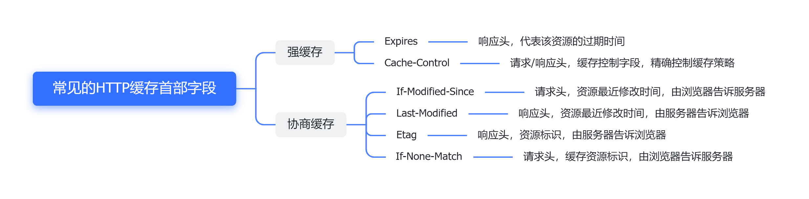

# HTTP

## HTTP缓存

### 为什么缓存

把请求响应的数据缓存在本地，下次请求前直接读取本地数据，不需要再获取服务器相应，提高性能。HTTP缓存技术有：**强缓存**和**协商缓存**

### 强缓存

#### 是啥

浏览器判断缓存没有过期，直接用了浏览器本地缓存。（是否使用由浏览器决定）

强缓存是利用下面这两个 **HTTP 响应头部字段**（Response Header）实现的，它们都用来表示资源在客户端缓存的有效期：

- `Cache-Control`， 是一个相对时间；
- `Expires`，是一个绝对时间；

如果 HTTP 响应头部同时有 Cache-Control 和 Expires 字段的话，**Cache-Control 的优先级高于 Expires** 

#### 使用 Cache-Control 实现流程

- 当浏览器第一次请求访问服务器资源时，服务器会在返回这个资源的同时，在 Response 头部加上 Cache-Control，Cache-Control 中设置了过期时间大小；
- 浏览器再次请求访问服务器中的该资源时，会先**通过请求资源的时间与 Cache-Control 中设置的过期时间大小，来计算出该资源是否过期**，如果没有，则使用该缓存，否则重新请求服务器；
- 服务器再次收到请求后，会再次更新 Response 头部的 Cache-Control。

### 协商缓存

客户端发请求给服务端，响应码为304，告知客户端可以使用本地缓存。（是否使用由两端协商决定）

#### 使用 ETag 字段实现的协商缓存流程

- 当浏览器第一次请求访问服务器资源时，服务器会在返回这个资源的同时，在 Response 头部加上 ETag 唯一标识，这个唯一标识的值是根据当前请求的资源生成的；

- 当浏览器再次请求访问服务器中的该资源时，首先会先检查强制缓存是否过期：

  - 如果没有过期，则直接使用本地缓存；
  - 如果缓存过期了，会在 Request 头部加上 If-None-Match 字段，该字段的值就是 ETag 唯一标识；

- 服务器再次收到请求后，

  会根据请求中的 If-None-Match 值与当前请求的资源生成的唯一标识进行比较：

  - **如果值相等，则返回 304 Not Modified，不会返回资源**；
  - 如果不相等，则返回 200 状态码和返回资源，并在 Response 头部加上新的 ETag 唯一标识；

- 如果浏览器收到 304 的请求响应状态码，则会从本地缓存中加载资源，否则更新资源

### HTTP无状态解决

使用Cookie。

客户端第一次向服务端请求，服务端生成一个Cookie，响应给客户端。

客户端后面的请求会带上Cookie，服务端识别Cookie成功后，响应对应的数据给客户端。

## 参考文献

https://xiaolincoding.com/network