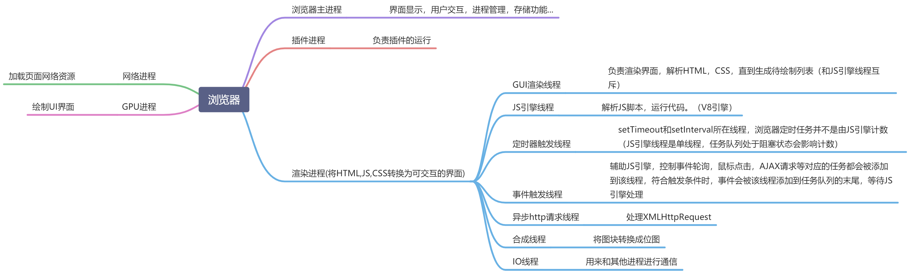

# 浏览器
##  输入URL后发生了什么
解析url；通过DNS查询找到IP地址；进行TCP连接建立请求并发送；得到响应数据后进行渲染。

## 渲染过程（关键渲染路径）
HTML 解析->DOM树

CSS 解析 -> CSSOM树（CSS对象模型）

根据DOM树和CSSOM树构建渲染树

进行**布局计算**，根据计算结果进行**绘制**

包含多个层的页面会进行**合成**

> 绘制
> https://juejin.cn/post/6938009725745233934#heading-7

## 浏览器进程
渲染进程（GUI线程在这里）

网络进程

浏览器主进程

GPU进程

插件进程

### GPU进程跟GUI线程的区别
GUI线程：在渲染进程里，每个标签页一个，负责执行js代码，解析DOM，样式计算，布局，绘制指令生成

GPU进程：全局只有一个，绘制UI界面，负责合成图层、硬件加速、把内容渲染到屏幕上

### 重排 重绘 合成

- 重排**会改变元素的几何位置**，需要更新完整的渲染流水线，所以开销也是最大的
- 重绘只是**修改元素的颜色等非位置属性**，所以省去了布局和分层阶段，开销比重排小
- 合成只会**由已提升会合成层的transform或opacity触发，只涉及几何变换或透明度变换**，会跳过前面的流程，直接进入合成阶段，开销最小。（**transform或opacity若未提升为合成层，则依然会触发paint**）

# 网络
## HTTP
### HTTP是什么
超文本传输协议。在**两点**之间**传输**文字、图片、视频、音频等**超文本**数据的**约定和规范**。
### HTTP常见状态码

| 1xx | 协议处理的中间状态              |
| --- | ---------------------- |
| 2xx | 成功，报文已经收到并被正确处理        |
| 3xx | 重定向，资源位置发生变动，需要重新发请求   |
| 4xx | 客户端错误，发送的报文有问题，服务器无法处理 |
| 5xx | 服务端错误，服务器处理请求时内部发生错误   |

#### 200
200OK，成功

#### 204
No Content，响应头没有body数据

#### 206
Partial Content，返回的body数据只有部分内容

#### 301
Moved Permanently，永久重定向，请求的资源已经不在了

#### 302
Found，临时重定向，请求的资源还在但是需要重定向
（301和302都会指明要跳转的url，浏览器会自动重定向）

#### 304
Not Modified，缓存重定向

#### 400
Bad Request，报文有误，笼统的错误

#### 403
Forbidden，服务器禁止访问资源

#### 404
Not Found，找不到请求的资源

#### 500
Internal Server Error，笼统的错误

#### 501
Not Implemented，请求的功能还不支持

#### 502
Bad Gateway，服务器作为网关或代理返回的错误

#### 503
Service Unavailable，服务器正忙无法响应

